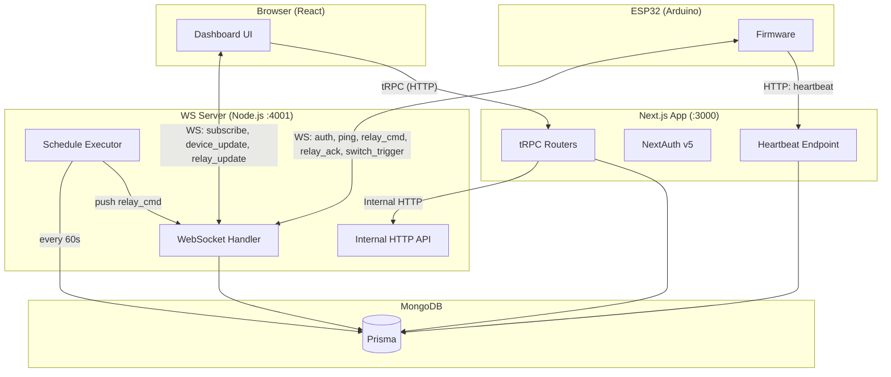
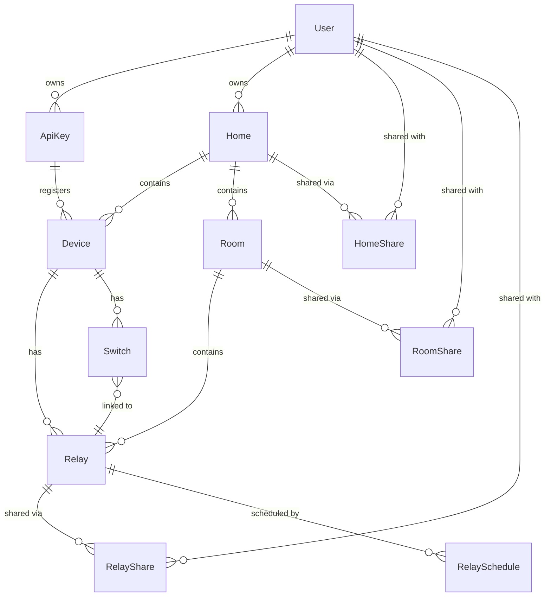
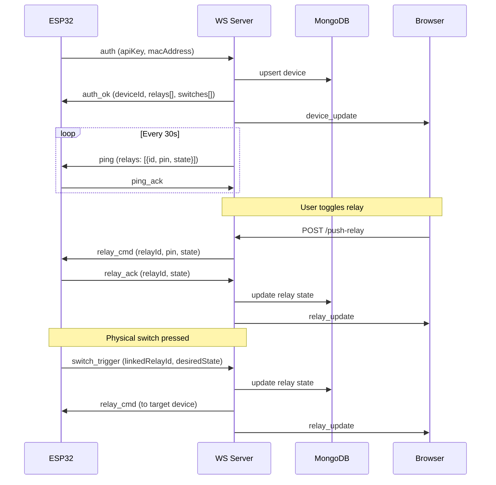
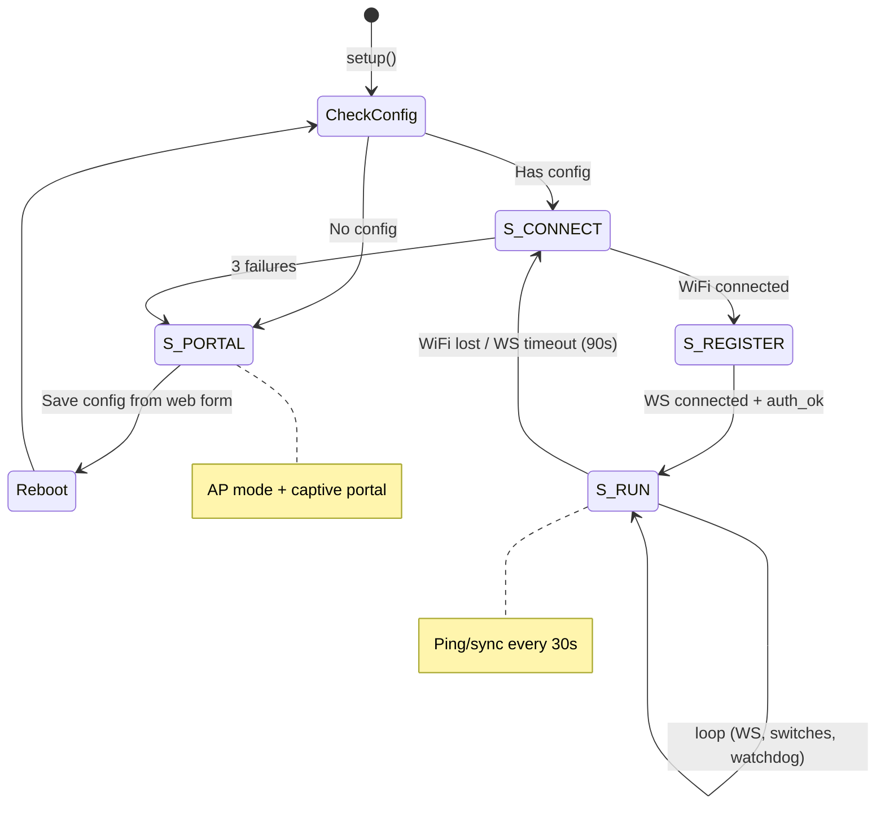
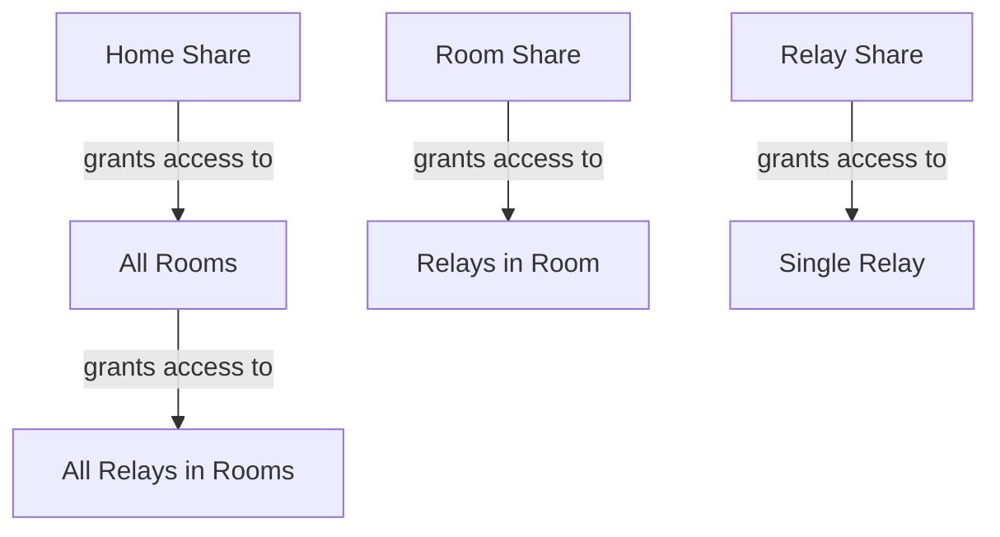
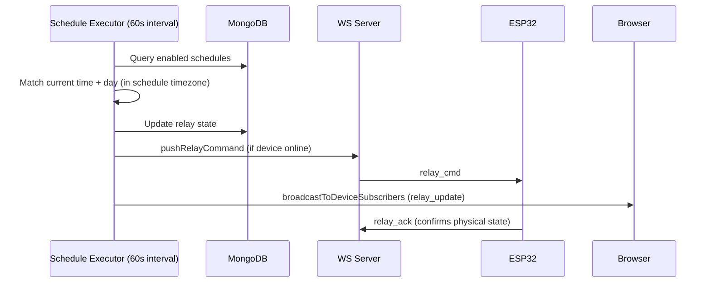

# SmartHUB — Home Automation Platform

## Overview

SmartHUB is a full-stack IoT platform for controlling ESP32 relay modules via a web dashboard. Users register ESP32 devices, configure GPIO relay outputs and switch inputs, organize them into homes and rooms, and toggle relays in real-time through WebSocket communication. The system supports cross-device switch-relay linking, granular sharing (home/room/relay), and scheduled relay automation.

## Architecture



## Data Model



## Tech Stack

### Dashboard (`dashboard/`)

- **Framework**: Next.js 16 (App Router), TypeScript
- **API**: tRPC v11 (React Query)
- **Auth**: NextAuth v5 (credentials + Google OAuth, JWT strategy)
- **DB**: MongoDB via Prisma 5
- **Styling**: Tailwind CSS 3, Radix UI, shadcn/ui
- **WebSocket**: `ws` library (standalone server on port 4001)
- **Theming**: Light/dark mode via next-themes, CSS variables in `globals.config.ts`

### ESP32 Firmware (`firmware/`)

- **Framework**: Arduino (PlatformIO, espressif32)
- **Board**: esp32dev (240MHz, 320KB RAM, 4MB Flash)
- **Libraries**: WebSockets 2.7.3, ArduinoJson 7.4.3
- **Storage**: NVS (Preferences) for config, relay states, switch config

## Project Structure

### Dashboard

```
prisma/schema.prisma              # MongoDB models
globals.config.ts                  # Theme color values
src/
  app/
    dashboard/
      page.tsx                     # Overview (homes, stats)
      homes/page.tsx               # Home list
      homes/[id]/page.tsx          # Home detail (rooms, devices)
      rooms/[id]/page.tsx          # Room detail (relays, schedules)
      devices/[id]/page.tsx        # Device detail (relays, switches, config)
      shared/page.tsx              # Shared homes/rooms/relays
      api-keys/page.tsx            # API key management
      settings/page.tsx            # User settings
    api/
      esp/register/route.ts        # ESP32 registration (HTTP POST)
      esp/heartbeat/route.ts       # ESP32 heartbeat sync
  components/
    dashboard/
      DashboardSidebar.tsx         # Collapsible sidebar
      DashboardOverviewClient.tsx  # Overview stats + home grid
      RelayScheduleDialog.tsx      # Schedule alarm UI
    ui/                            # shadcn/ui components
  providers/
    DeviceSocketProvider.tsx       # WS connection manager
  server/
    ws-server.ts                   # WS + HTTP server + schedule executor
    api/routers/
      device.ts                    # CRUD + toggleRelay + pingDevice
      home.ts                      # CRUD + device assignment
      room.ts                      # CRUD + relay assignment
      schedule.ts                  # Relay schedule CRUD
      sharing.ts                   # Home/room/relay sharing
      switch.ts                    # Physical switch CRUD
      apiKey.ts                    # API key CRUD
      user.ts                      # User queries
    api/lib/permissions.ts         # getDeviceAccess, getRelayAccess
```

### ESP32

```
platformio.ini                     # PlatformIO config
src/main.cpp                       # State machine: PORTAL → CONNECT → REGISTER → RUN
include/
  Config.h                         # Constants (timeouts, max relays, LED pin)
  Storage.h                        # NVS read/write
  CaptivePortal.h                  # WiFi AP + config web form
  HubClient.h                      # WebSocket client: auth, ping, relay commands
  RelayManager.h                   # GPIO output management
  SwitchManager.h                  # Input pin monitoring (two-way/three-way/momentary)
```

## WebSocket Protocol

### ESP32 <-> WS Server



### Internal HTTP (tRPC -> WS Server, port 4001)

| Endpoint                                | Purpose                |
| --------------------------------------- | ---------------------- |
| `POST /push-relay`                      | Toggle relay command   |
| `POST /push-relay-add`                  | New relay notification |
| `POST /push-relay-update`               | Relay config change    |
| `POST /push-switch-add\|update\|delete` | Switch lifecycle       |
| `POST /ping-device`                     | On-demand ping         |
| `POST /refresh-device-subscribers`      | Rebuild subscriber set |

All endpoints require `x-internal-secret` header matching `WS_SECRET`.

## ESP32 Boot Flow



## Sharing & Permissions



Access check chain (`getRelayAccess`): Owner -> RelayShare -> RoomShare -> HomeShare

## Relay Scheduling

Schedules are alarm-like: select days, time, and on/off action per relay.



ESP32 is authoritative for physical relay state. If a scheduled change can't be pushed (device offline), the next heartbeat or WS ping delivers the desired state.

## Heartbeat

`POST /api/esp/heartbeat` — called every 60s by ESP32 as a fallback sync mechanism.

- ESP32 reports its physical relay states (authoritative)
- Server returns desired relay states (includes any pending scheduled changes)
- `lastSeenAt` updates are rate-limited (30s throttle)

## Switch Types

| Type      | Wiring              | Detection                 | GPIO Mode       |
| --------- | ------------------- | ------------------------- | --------------- |
| Two-way   | SPST (VCC/floating) | Poll + 50ms debounce      | INPUT_PULLDOWN  |
| Three-way | SPDT (VCC/GND)      | Poll + 50ms debounce      | INPUT (no pull) |
| Momentary | Push button         | ISR RISING + release gate | INPUT_PULLDOWN  |

Cross-device: A switch on Device A can control a relay on Device B (same owner). WS server resolves routing.

## Environment Variables

```env
# Dashboard (.env)
DATABASE_URL=mongodb+srv://...
NEXTAUTH_URL=http://localhost:3000
NEXTAUTH_SECRET=...
AUTH_GOOGLE_CLIENT_ID=...
AUTH_GOOGLE_CLIENT_SECRET=...
WS_PORT=4001
WS_SECRET=...
WS_INTERNAL_URL=http://localhost:4001
```

## Running Locally

```bash
# Dashboard (from root)
npm install
npm run dev          # Next.js on :3000
npm run ws           # WS server on :4001
npm run db:push      # Prisma push

# ESP32
cd firmware
pio run --target upload
pio device monitor
```

## Key Design Decisions

- **ESP32 is authoritative** for physical relay states. Server stores desired state; ESP32 confirms via `relay_ack` or heartbeat reconciliation.
- **Heartbeat as safety net**: REST endpoint syncs any missed WS updates. Runs every 60s alongside the WS ping (every 30s).
- **Room-centric organization**: Homes contain rooms, rooms contain relays. Relays physically belong to devices but are logically organized into rooms.
- **Granular sharing**: Share at home (all rooms/relays), room, or individual relay level.
- **Server-side scheduling**: WS server checks schedules every 60s, pushes changes via existing relay command infrastructure.
- **Cross-device switches**: WS server resolves switch-relay links across devices.
- **Optimistic UI**: Relay toggles update UI immediately. `relay_ack` confirms. 5s timeout rolls back.
- **NVS persistence**: ESP32 stores relay states in flash. On boot, loads cached states so relays don't flicker. Server config overrides on connect.
