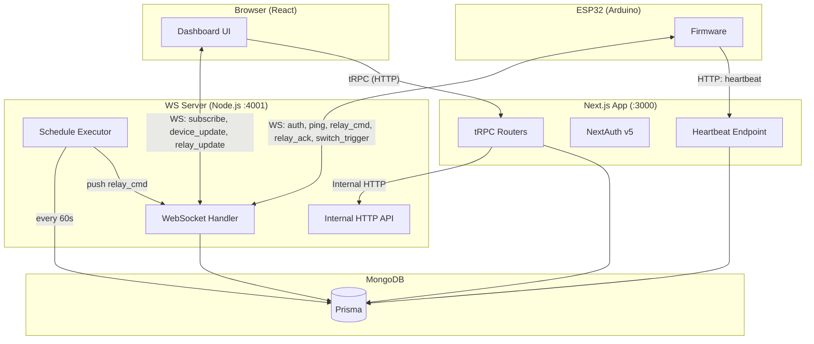

# SmartHUB - Home Automation Platform

SmartHUB is a full-stack IoT platform for controlling ESP32 relay modules via a web dashboard. Users register ESP32 devices, configure GPIO relay outputs and switch inputs, organize them into homes and rooms, and toggle relays in real-time through WebSocket communication.

## Architecture



## Documentation

| Topic                                            | Description                                                           |
| ------------------------------------------------ | --------------------------------------------------------------------- |
| [Data Model](docs/data-model.md)                 | Entity relationships - users, homes, rooms, devices, relays, switches |
| [Tech Stack](docs/tech-stack.md)                 | Frameworks and libraries for dashboard and firmware                   |
| [Project Structure](docs/project-structure.md)   | File layout for dashboard and ESP32 firmware                          |
| [WebSocket Protocol](docs/websocket-protocol.md) | Message sequences and internal HTTP API                               |
| [ESP32 Firmware](docs/esp32.md)                  | Boot flow, heartbeat, switch types, NVS persistence                   |
| [Sharing & Permissions](docs/sharing.md)         | Home/room/relay access model                                          |
| [Relay Scheduling](docs/scheduling.md)           | Alarm-style schedule execution                                        |
| [Design Decisions](docs/design-decisions.md)     | Rationale behind key architectural choices                            |
| [Setup & Running Locally](docs/setup.md)         | Environment variables and dev commands                                |
| [Deployment](deployment.md)                      | Docker Compose self-hosted deployment                                 |

## Quick Start

```bash
npm install
npm run dev   # Next.js :3000
npm run ws    # WS server :4001
```

See [docs/setup.md](docs/setup.md) for full setup instructions and [deployment.md](deployment.md) for production deployment.
