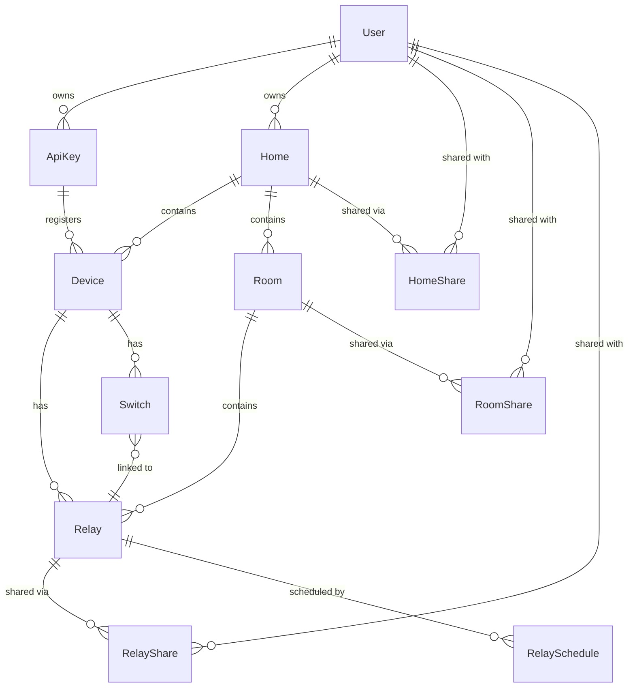

# Data Model

## Key Relationships

- **User → Home → Room → Relay**: Core organizational hierarchy. Relays physically live on devices but are logically assigned to rooms.
- **Device → Relay / Switch**: A device owns its physical GPIO outputs (relays) and inputs (switches).
- **Switch → Relay**: Cross-device link - a switch on Device A can control a relay on Device B (same owner). WS server resolves routing.
- **ApiKey → Device**: ESP32 devices register using an API key belonging to their owner.
- **Shares**: Granular access at home, room, or relay level. See [Sharing & Permissions](sharing.md).
