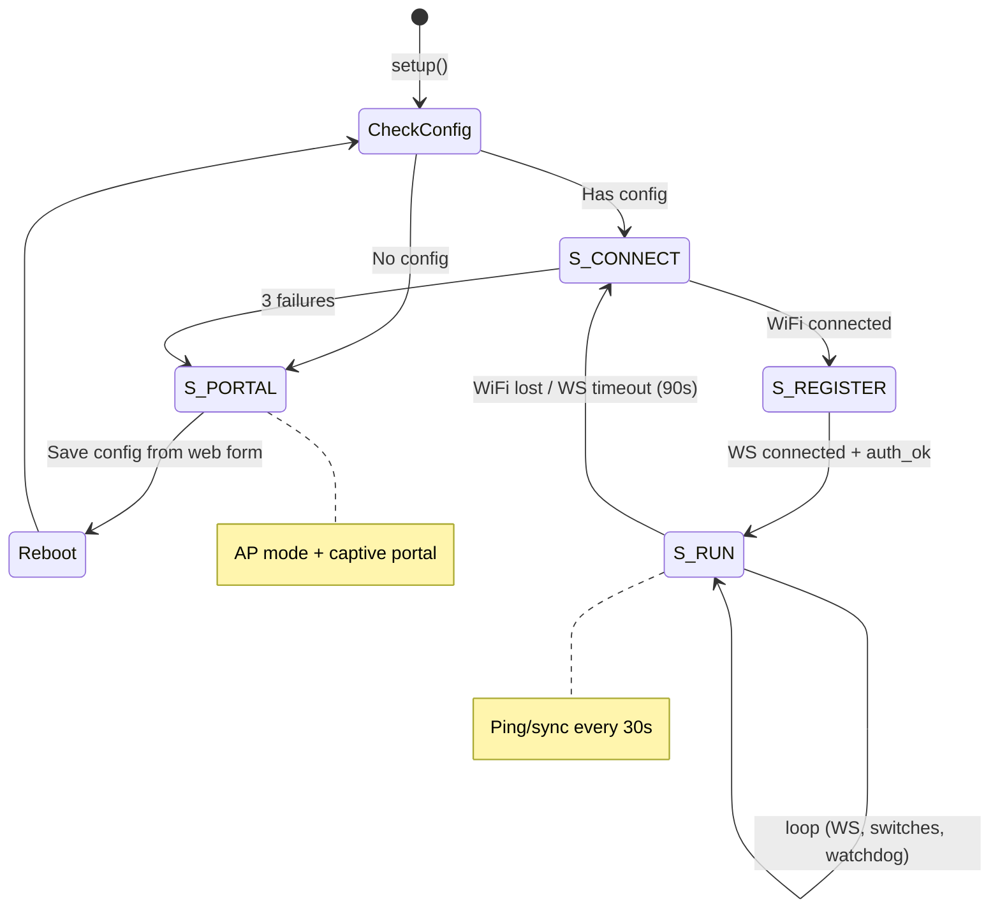

# ESP32 Firmware

## Boot Flow

## Heartbeat

`POST /api/esp/heartbeat` — called every 60s by ESP32 as a fallback sync mechanism.

- ESP32 reports its physical relay states (authoritative)
- Server returns desired relay states (includes any pending scheduled changes)
- `lastSeenAt` updates are rate-limited (30s throttle)

If a relay command is missed over WebSocket (e.g. device was briefly offline), the next heartbeat delivers the desired state.

## Switch Types

| Type      | Wiring              | Detection                 | GPIO Mode       |
| --------- | ------------------- | ------------------------- | --------------- |
| Two-way   | SPST (VCC/floating) | Poll + 50ms debounce      | INPUT_PULLDOWN  |
| Three-way | SPDT (VCC/GND)      | Poll + 50ms debounce      | INPUT (no pull) |
| Momentary | Push button         | ISR RISING + release gate | INPUT_PULLDOWN  |

Cross-device switching: A switch on Device A can control a relay on Device B (same owner). The WS server resolves routing via the `switch_trigger` message.

## NVS Persistence

ESP32 stores relay states in flash (NVS). On boot, cached states are loaded so relays don't flicker. Server config overrides on WebSocket connect.
