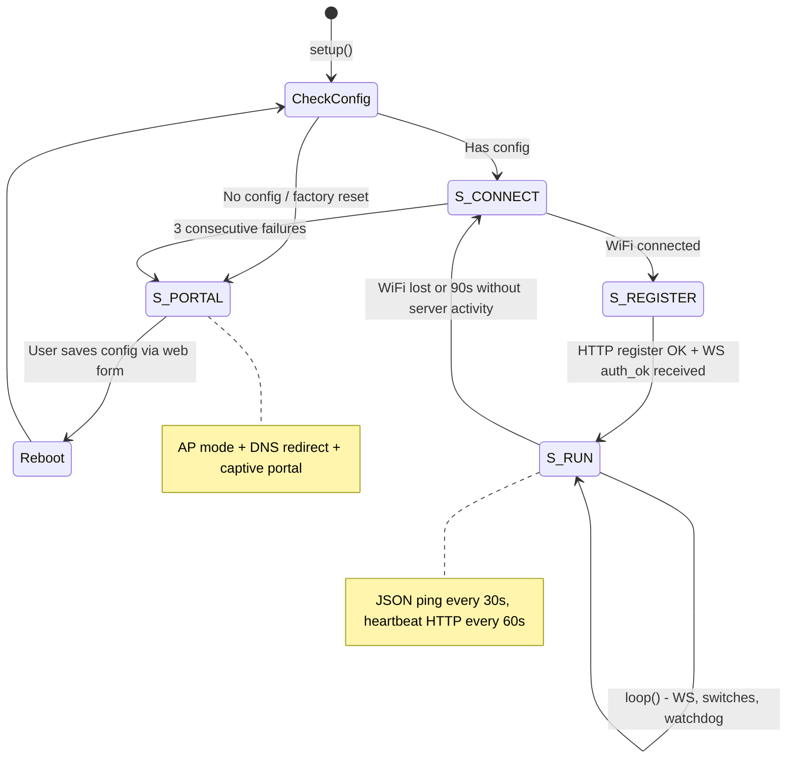

# ESP32 Firmware

## Boot Flow

### S_PORTAL - Captive Portal

- WiFi AP SSID: **`SmartHUB-AABBCC`** (unique per device - last 3 bytes of MAC)
- DNS server catches all domains → 302 redirect to `192.168.4.1` (triggers OS captive portal popup on iOS/Android)
- Embedded HTTP server serves config form: WiFi credentials, API key, server host, port, dev mode toggle
- Dev mode disabled: forces port 443 + TLS
- **5-minute timeout** → `ESP.restart()`

### Factory Reset

Hold GPIO 0 (BOOT button) for 3 seconds at any time. On confirmation:

1. `Storage::clear()` - wipes NVS namespace, then writes a `factory_rst` flag
2. `ESP.restart()` → device re-enters PORTAL
3. On next registration (`/api/esp/register`), server reads `consumeFactoryResetFlag()` → deletes all relays for the device + clears `homeId`

Also supported during `S_REGISTER` failure - the 5-second delay was replaced with a polling loop so the reset button is checked every 10ms.

---

## Heartbeat

`POST /api/esp/heartbeat` - ESP32 calls this every 60s as a fallback sync:

- ESP32 reports its **physical** relay states (authoritative - writes to DB)
- Server returns **desired** relay states (picks up any missed WS commands)
- `lastSeenAt` updates are throttled: only written to DB if >30s since last write
- If a device was offline when a schedule fired, the heartbeat delivers the pending state

The WS `ping` (every 30s) and heartbeat (every 60s) together ensure state stays in sync even through brief disconnections.

---

## Switch Types

| Type      | Wiring               | GPIO mode         | Detection                             |
| --------- | -------------------- | ----------------- | ------------------------------------- |
| Two-way   | SPST: VCC ↔ floating | `INPUT_PULLDOWN`  | Poll + 50ms software debounce         |
| Three-way | SPDT: VCC ↔ GND      | `INPUT` (no pull) | Poll + 50ms software debounce         |
| Momentary | Push button (NO)     | `INPUT_PULLDOWN`  | ISR on `RISING` edge + 150ms cooldown |

### Momentary ISR design

The `WebSocketsClient::loop()` can block for 10–50ms, which is longer than a short button press (200–400ms press → clean rising edge is narrow). Polling would miss events. Solution:

- ISR (`IRAM_ATTR`) atomically sets a bit flag in `_pendingFlags` on RISING edge
- Main loop checks flags with a 150ms cooldown gate
- For **input-only pins (34–39)** that have no internal pull resistors: floating noise triggers false positives, so the ISR sets a "confirm pending" flag instead, then the main loop samples the pin 6 times - requires 5/6 HIGH (≥83%) before accepting as a valid press

### Cross-device switches

A switch on Device A can toggle a relay on Device B (as long as both belong to the same owner). The ESP32 sends `switch_trigger { linkedRelayId, desiredState, isToggle }`. The WS server:

1. Looks up the target relay
2. Validates same-user ownership
3. Writes new state to DB
4. Sends `relay_cmd` to the **target** device's socket (not the triggering device)
5. Broadcasts `relay_update` to all subscribers

---

## GPIO Pin Guidelines

| Purpose              | Usable pins             | Notes                                            |
| -------------------- | ----------------------- | ------------------------------------------------ |
| **Relays** (output)  | 4, 5, 13–27, 32, 33     | Support both input and output; avoid 34–39       |
| **Switches** (input) | 34–39 (ideal), any GPIO | Pins 34–39 are input-only - perfect for switches |

Pins 34, 35, 36, 37, 38, 39 are **input-only** on all ESP32 variants - they have no output driver and no internal pull resistor. The firmware rejects pins 34–39 for relay output (`RelayManager` ignores `pinMode(OUTPUT)` on these).

GPIO 0 is reserved for the factory reset button (BOOT button on most dev boards).

---

## NVS Persistence

All config is stored in the NVS (Non-Volatile Storage) namespace `esp_hub` using the Arduino `Preferences` library:

| Key                 | Type    | Content                                             |
| ------------------- | ------- | --------------------------------------------------- |
| `ssid`              | String  | WiFi SSID                                           |
| `pass`              | String  | WiFi password                                       |
| `dev_name`          | String  | Device name                                         |
| `api_key`           | String  | API key (`ehk_...`)                                 |
| `server_host`       | String  | Dashboard hostname                                  |
| `server_port`       | UInt16  | Dashboard port                                      |
| `server_sec`        | Bool    | Use TLS (`wss://`)                                  |
| `dev_mode`          | Bool    | Dev mode flag                                       |
| `device_id`         | String  | Assigned device ID (saved after registration)       |
| `r0_id` … `r7_id`   | String  | Relay IDs                                           |
| `r0_pin` … `r7_pin` | UInt8   | Relay GPIO pins                                     |
| `r0_st` … `r7_st`   | Bool    | **Relay states** - written on every toggle          |
| `d0_*` … `d7_*`     | Various | Switch config (id, pin, label, type, linkedRelayId) |
| `factory_rst`       | Bool    | One-shot factory reset flag                         |

**Flash wear optimization**: `saveRelayState(index, bool)` writes only the single `rN_st` key rather than the whole relay array. A typical relay might toggle many thousands of times - writing only one NVS key per toggle significantly extends flash lifetime vs. writing all 8 relays on every change.

---

## Status LED

| Mode             | Blink pattern | When                        |
| ---------------- | ------------- | --------------------------- |
| `LED_BLINK_FAST` | 200ms on/off  | Captive portal AP mode      |
| `LED_BLINK_SLOW` | 1000ms on/off | Connecting (WiFi or WS)     |
| `LED_SOLID`      | Always on     | Connected and authenticated |
| `LED_OFF`        | Always off    | Explicitly turned off       |

`STATUS_LED_PIN` and `STATUS_LED_ACTIVE_LOW` are configurable in `Config.h`. Blink is non-blocking (uses `millis()` comparison).
