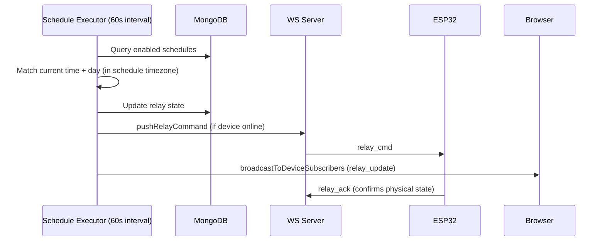

# Relay Scheduling

Schedules are alarm-like: select days, time, and on/off action per relay. The WS server checks all enabled schedules every 60 seconds.

## Flow

## Offline Handling

If the device is offline when a schedule fires, the desired state is persisted in the DB. The next heartbeat or WS ping will deliver the pending state once the device comes back online.

ESP32 is authoritative for physical relay state - `relay_ack` is the confirmation.
