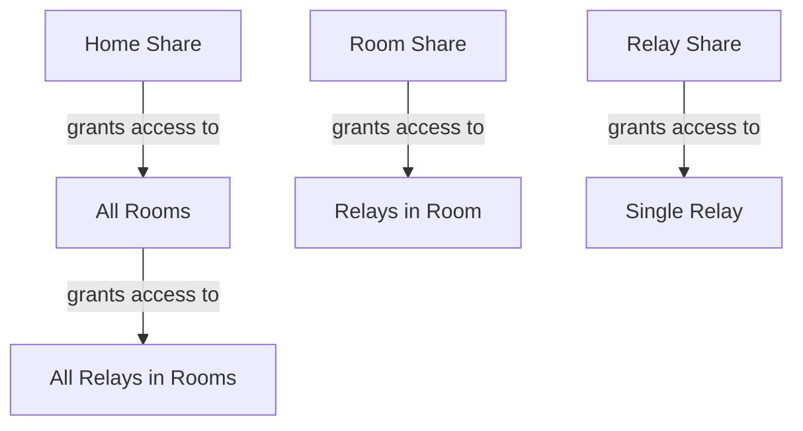

# Sharing & Permissions

## Access Hierarchy

## Access Check Chain

`getRelayAccess` resolves in this order: **Owner → RelayShare → RoomShare → HomeShare**

The first matching grant wins. This means:

- Sharing a home implicitly grants access to all its rooms and relays.
- Sharing a room implicitly grants access to all relays in that room.
- Sharing a relay grants access to only that relay.
