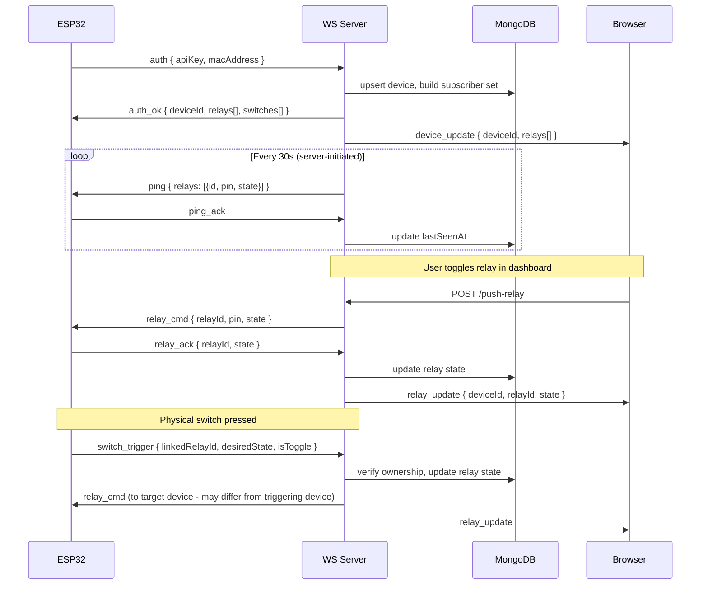
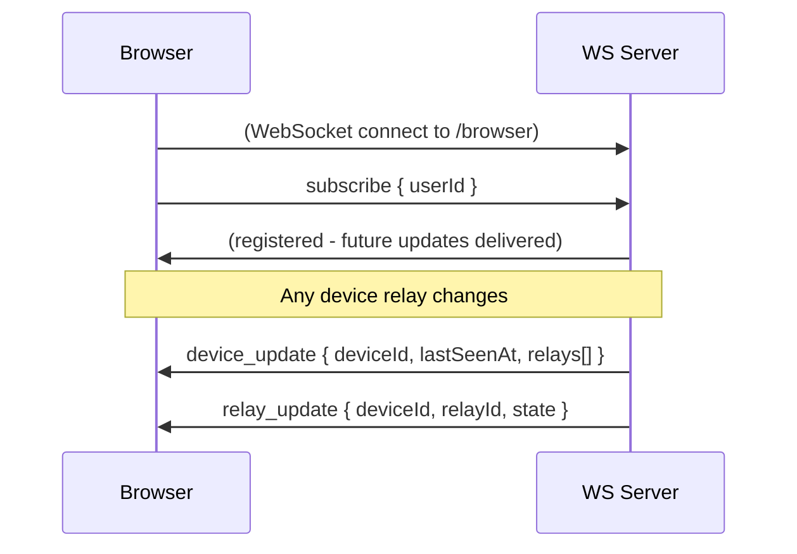

# WebSocket Protocol

## Connection URLs

| Client  | URL                 | Handler                   |
| ------- | ------------------- | ------------------------- |
| ESP32   | `ws://HOST/`        | `handleDeviceConnection`  |
| Browser | `ws://HOST/browser` | `handleBrowserConnection` |

In development both connect to `localhost:3000` (combined server). In production the WS server is exposed by Caddy on `HOST:4001`.

---

## ESP32 ↔ WS Server

### Messages: ESP32 → Server

| Message          | Fields                                      | Server action                                                                                                                                           |
| ---------------- | ------------------------------------------- | ------------------------------------------------------------------------------------------------------------------------------------------------------- |
| `auth`           | `apiKey`, `macAddress`, `deviceId?`         | Upsert device in DB; build subscriber set; send `auth_ok`; broadcast `device_update` to all subscribers                                                 |
| `ping_ack`       | -                                           | Resolve pending on-demand ping; update `lastSeenAt` in DB                                                                                               |
| `relay_ack`      | `relayId`, `state`                          | Write state to DB; broadcast `relay_update` to subscribers                                                                                              |
| `switch_trigger` | `linkedRelayId`, `desiredState`, `isToggle` | Validate same-user ownership; compute new state (`isToggle` XORs current); write DB; send `relay_cmd` to target device socket; broadcast `relay_update` |

### Messages: Server → ESP32

| Message                | Fields                               | When sent                                            |
| ---------------------- | ------------------------------------ | ---------------------------------------------------- |
| `auth_ok`              | `deviceId`, `relays[]`, `switches[]` | Successful authentication                            |
| `auth_fail`            | `reason`                             | API key invalid or inactive                          |
| `ping`                 | `relays: [{id, pin, state}]`         | Every 30s - keepalive + authoritative state sync     |
| `relay_cmd`            | `relayId`, `pin`, `state`            | User toggle, schedule fire, or cross-device switch   |
| `relay_add`            | `relay`                              | Relay created in dashboard while device is connected |
| `relay_update_config`  | `relay`                              | Relay pin/label/icon changed in dashboard            |
| `switch_add`           | `switch`                             | Switch created in dashboard                          |
| `switch_update_config` | `switch`                             | Switch config changed                                |
| `switch_delete`        | `switchId`                           | Switch deleted                                       |

---

## Browser ↔ WS Server

| Direction    | Message         | Payload                                           |
| ------------ | --------------- | ------------------------------------------------- |
| Browser → WS | `subscribe`     | `{ userId: string }`                              |
| WS → Browser | `device_update` | `{ deviceId, lastSeenAt, relays: [{id, state}] }` |
| WS → Browser | `relay_update`  | `{ deviceId, relayId, state }`                    |

The browser's `DeviceSocketProvider` sends `subscribe` immediately on connection open. All relay state changes (from ESP32 `relay_ack`, switch triggers, or schedule fires) broadcast `relay_update` to every subscriber of the device.

---

## Connection Keepalive

Two independent mechanisms keep connections alive and detect failures:

| Mechanism           | Interval      | Scope                   | Purpose                                                          |
| ------------------- | ------------- | ----------------------- | ---------------------------------------------------------------- |
| WS-level PING frame | 30s           | All connections         | TCP-level dead connection detection (Wi-Fi drop without TCP FIN) |
| JSON `ping` message | 30s           | Device connections only | Application-level keepalive + authoritative relay state sync     |
| ESP32 watchdog      | 90s threshold | ESP32 side              | Force-reconnect if no server activity                            |

The WS-level heartbeat (`ws.ping()` via `wss.clients`) is especially important for browser connections, which have no application-level ping.

---

## Internal HTTP API (tRPC → WS Server)

Next.js tRPC procedures call the WS server over HTTP to push commands to connected devices. The base URL comes from `WS_INTERNAL_URL` env var (`http://localhost:3000` in dev, `http://wsserver:4001` in Docker).

All endpoints require:

- Method: `POST`
- Header: `x-internal-secret: <WS_SECRET>`
- Body: JSON

| Endpoint                      | Body                                | Returns                   | Purpose                                                     |
| ----------------------------- | ----------------------------------- | ------------------------- | ----------------------------------------------------------- |
| `/push-relay`                 | `{ deviceId, relayId, pin, state }` | `{ ok, pushed }`          | Send `relay_cmd` to device                                  |
| `/push-relay-update`          | `{ deviceId, relay }`               | `{ ok, pushed }`          | Send `relay_update_config` to device                        |
| `/push-relay-add`             | `{ deviceId, relay }`               | `{ ok, pushed }`          | Send `relay_add` to device                                  |
| `/push-switch-add`            | `{ deviceId, switch }`              | `{ ok, pushed }`          | Send `switch_add` to device                                 |
| `/push-switch-update`         | `{ deviceId, switch }`              | `{ ok, pushed }`          | Send `switch_update_config` to device                       |
| `/push-switch-delete`         | `{ deviceId, switchId }`            | `{ ok, pushed }`          | Send `switch_delete` to device                              |
| `/ping-device`                | `{ deviceId, timeoutMs? }`          | `{ online }`              | Send `ping`, wait for `ping_ack` (default 3s timeout)       |
| `/refresh-device-subscribers` | `{ deviceId }`                      | `{ ok, subscriberCount }` | Rebuild subscriber set from DB (call after sharing changes) |

`pushed: false` means the device socket exists but wasn't open (device offline). The relay command is not queued - tRPC falls back to writing desired state to DB so the next heartbeat delivers it.
