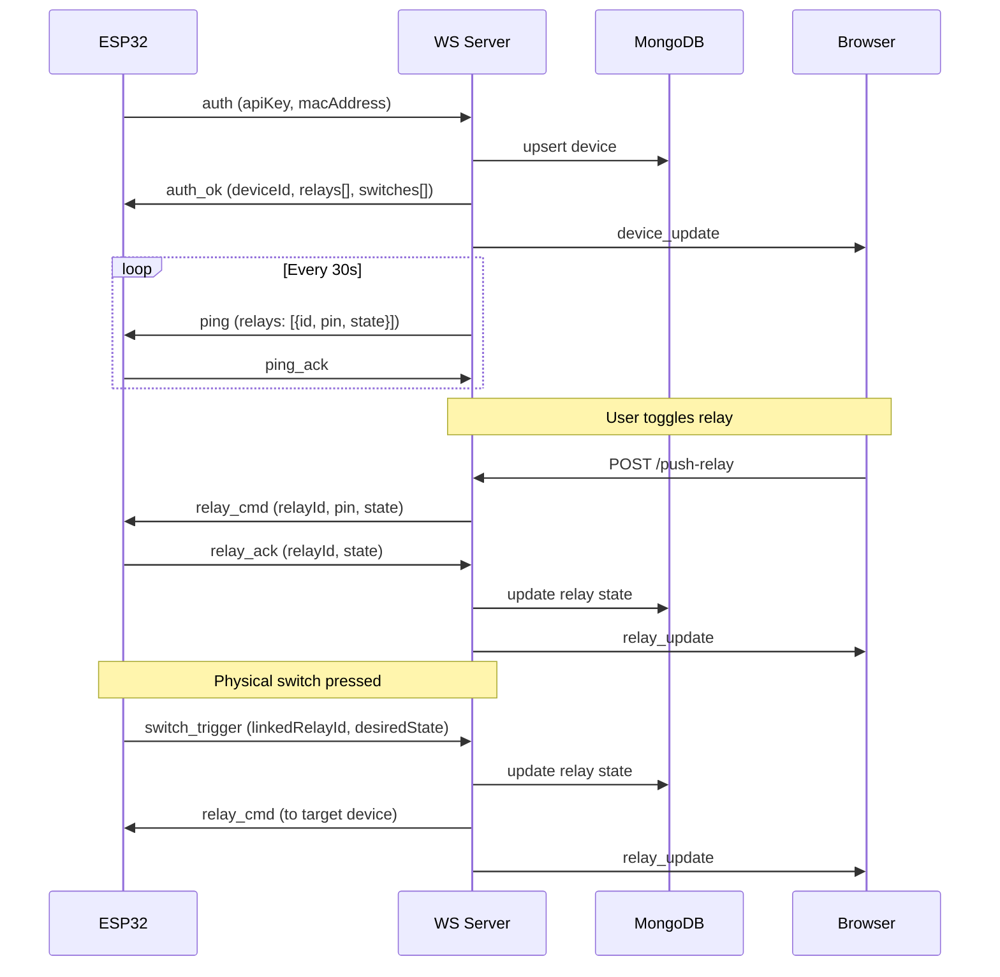

# WebSocket Protocol

## ESP32 ↔ WS Server

## Browser ↔ WS Server

| Direction    | Message         | Payload                      |
| ------------ | --------------- | ---------------------------- |
| Browser → WS | `subscribe`     | `deviceId`                   |
| WS → Browser | `device_update` | Device online/offline status |
| WS → Browser | `relay_update`  | `relayId`, `state`           |

## Internal HTTP (tRPC → WS Server, port 4001)

All endpoints require `x-internal-secret` header matching `WS_SECRET`.

| Endpoint                                | Purpose                |
| --------------------------------------- | ---------------------- |
| `POST /push-relay`                      | Toggle relay command   |
| `POST /push-relay-add`                  | New relay notification |
| `POST /push-relay-update`               | Relay config change    |
| `POST /push-switch-add\|update\|delete` | Switch lifecycle       |
| `POST /ping-device`                     | On-demand ping         |
| `POST /refresh-device-subscribers`      | Rebuild subscriber set |
